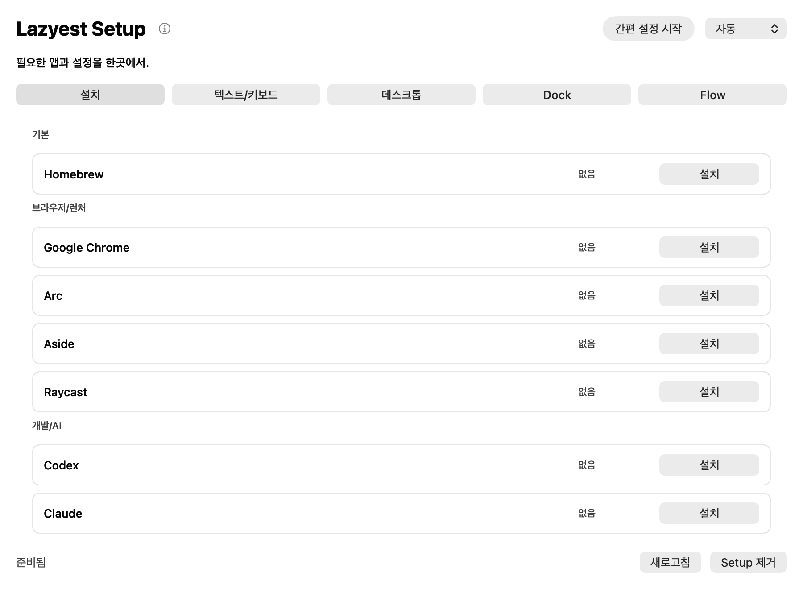

# mac-bootstrap

한국어 사용자와 개발자를 위한 **일회성 macOS 초기 설정 앱**입니다. `MacBootstrapSetup.app`에서 필요한 항목만 선택해 적용하고, 초기 설정이 끝나면 Setup 앱을 삭제할 수 있습니다.

- Current version: [`0.3.2`](VERSION)
- macOS 13+
- Apple Silicon Mac에서 테스트
- [The Unlicense](UNLICENSE)



## Agent는 별도 프로젝트입니다

상시 실행 메뉴 막대 앱은 [mac-bootstrap-agent](https://github.com/hyunn515/mac-bootstrap-agent)에서 독립적으로 개발하고 설치합니다.

Setup의 `Agent` 탭에서 설치 버튼을 누르면 별도 Agent 프로젝트를 내려받아 `/Applications/MacBootstrapAgent.app`으로 설치합니다. Setup 저장소에는 Agent 소스나 런타임 설정을 포함하지 않습니다.

## Setup 기능

### 앱 설치

- Homebrew
- Chrome, Arc, Aside, Raycast
- Codex, Claude, Cursor, VS Code, Zed, Docker Desktop, iTerm2
- Teams, Slack
- Gureum 입력기, Karabiner-Elements, LinearMouse, Amphetamine

### 텍스트와 키보드

- Gureum 두벌식 입력 소스 등록
- Karabiner Complex Modification으로 오른쪽 Command를 `F18`로 변경
- 이전 입력 소스 단축키 비활성화 및 다음 입력 소스를 `F18`로 설정
- 키 반복, 길게 눌러 악센트, 기능 키, Globe/Fn 키 설정
- 맞춤법 자동 수정, 스페이스 두 번 마침표, 인라인 자동 완성 설정

### 데스크톱과 Dock

- 배경화면 클릭으로 데스크톱 보기 방지
- macOS 내장 검은색 배경화면 적용
- Dock 자동 숨김
- 체크리스트로 Dock 기본 앱 구성

각 항목은 현재 상태를 다시 읽어 `설치`, `열기`, `적용`, `초기화`처럼 가능한 다음 행동을 표시합니다.

## 빠른 시작

```sh
git clone https://github.com/hyunn515/mac-bootstrap.git
cd mac-bootstrap

./bootstrap.sh audit
./bootstrap.sh plan
./bootstrap.sh install-plan
./bootstrap.sh build-setup
./bootstrap.sh install-setup

open /Applications/MacBootstrapSetup.app
```

앱 설치만으로 시스템 설정을 자동 적용하지 않습니다. Setup UI에서 사용자가 누른 항목만 변경합니다.

## 주요 명령어

읽기 전용:

```sh
./bootstrap.sh version
./bootstrap.sh audit
./bootstrap.sh plan
./bootstrap.sh install-plan
```

Setup 앱:

```sh
./bootstrap.sh build-setup [--dry-run]
./bootstrap.sh install-setup [--dry-run]
./bootstrap.sh uninstall-setup [--dry-run]
```

별도 Agent 연결:

```sh
./bootstrap.sh install-agent [--dry-run]
./bootstrap.sh uninstall-agent [--dry-run]
```

macOS 설정 명령 전체는 `./bootstrap.sh help`에서 확인할 수 있습니다. 실제 적용 전에는 대응하는 `--dry-run`을 먼저 사용할 수 있습니다.

## 안전한 기본값

- Setup을 열면 상태만 읽고 설정을 강제로 적용하지 않습니다.
- 기본 앱 단축키나 상시 실행 기능을 추가하지 않습니다.
- 비밀번호, 토큰, Keychain 값과 전체 환경변수를 저장하거나 출력하지 않습니다.
- `sudo` 또는 생체 인증이 필요하면 사용자가 직접 확인합니다.
- Agent 설치는 기존 `~/Library/Application Support/MacBootstrapAgent/` 설정을 덮어쓰지 않습니다.

## Agent 설치 방식

Agent 저장소와 설치할 리비전은 [`config/bootstrap.conf`](config/bootstrap.conf)의 `AGENT_REPOSITORY`, `AGENT_REF`에서 변경할 수 있습니다. Setup은 해당 소스를 임시 폴더에 내려받고 Agent 저장소의 설치 명령을 실행한 뒤 임시 파일을 삭제합니다.

현재는 GitHub Release 바이너리 대신 소스 빌드를 사용하므로 Swift 도구 모음이 필요합니다.

## For AI Agents

1. `README.md`, `VERSION`, `config/bootstrap.conf`를 먼저 읽습니다.
2. 변경 전 `./bootstrap.sh audit`, `plan`, `install-plan`을 실행합니다.
3. 사용자가 명시적으로 요청하기 전에는 `install-*`, `uninstall-*`, `apply-*`, `reset-*`, `dock-*`를 실행하지 않습니다.
4. Agent 기능을 수정할 때는 이 저장소가 아니라 별도 `mac-bootstrap-agent` 저장소에서 작업합니다.
5. 빌드 성공만으로 완료하지 말고 설치된 앱과 실제 macOS 상태를 확인합니다.
6. 비밀번호, 토큰, Keychain 값, 인증 정보와 전체 환경변수를 출력하지 않습니다.

## 검증

```sh
bash -n bootstrap.sh scripts/*.sh
./bootstrap.sh audit
./bootstrap.sh plan
./bootstrap.sh install-plan
./bootstrap.sh build-setup --dry-run
./bootstrap.sh install-agent --dry-run
swift build --package-path setup/MacBootstrapSetup -c release --product MacBootstrapSetup
```
