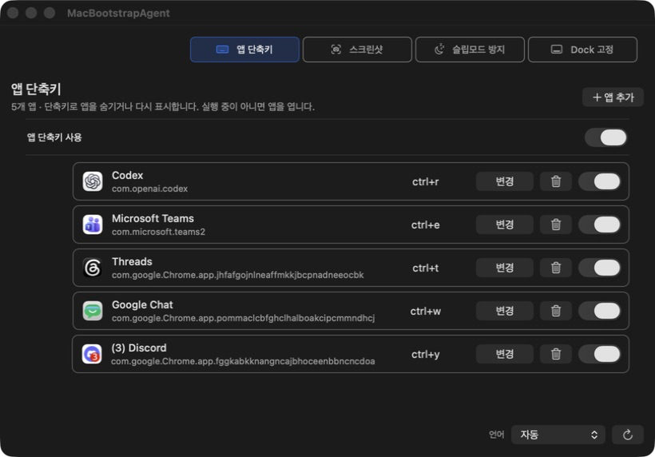

# mac-bootstrap

한국어 사용자와 개발자를 위한 재사용 가능한 macOS 초기 설정 도구입니다.

한 번 실행하고 지울 수 있는 `MacBootstrapSetup.app`과 계속 실행되는 메뉴 막대 앱 `MacBootstrapAgent.app`을 분리했습니다. 새 Mac에 설치해도 설정을 강제로 적용하지 않으며, 사용자가 UI에서 누른 항목만 변경합니다.

- Current version: [`0.2.0`](VERSION)
- Supported source build: macOS 13+
- Tested hardware: Apple Silicon Mac
- Runtime dependencies: Raycast와 Hammerspoon에 의존하지 않음
- License: [The Unlicense](UNLICENSE)

> 현재 저장소는 소스 빌드 단계입니다. 공개 배포용 Developer ID 서명과 Apple 공증을 거친 설치 패키지는 아직 제공하지 않습니다.

## 앱 화면

아래 이미지는 기능을 켜고 앱을 등록한 예시입니다. **새 설치에서는 Agent 기능이 모두 꺼져 있고 앱 단축키 목록도 비어 있습니다.**

**Setup: 앱 설치**


**Agent: 앱 단축키**



## 구성

| 구성 요소 | 실행 방식 | 역할 |
| --- | --- | --- |
| `MacBootstrapSetup.app` | Dock에 나타나는 일반 앱 | 앱 설치, 한국어 입력, 키보드, 데스크톱, Dock 같은 일회성 설정 |
| `MacBootstrapAgent.app` | 메뉴 막대 앱 | 앱 단축키, 스크린샷 클립보드 복사, 슬립모드 방지, Dock 고정 |
| `bootstrap.sh` | 터미널 진입점 | 감사, 계획, 빌드, 설치, 개별 설정 적용과 초기화 |

Setup은 설정이 끝나면 삭제할 수 있습니다. Agent는 기능을 사용하는 동안 계속 실행합니다.

## 안전한 기본값

새 설치는 아무 동작도 강제로 켜지 않습니다.

- Setup 설치는 `/Applications/MacBootstrapSetup.app` 복사만 수행합니다.
- Setup을 열면 현재 상태만 읽습니다. 각 행의 버튼을 눌러야 변경됩니다.
- Agent 설치는 `/Applications/MacBootstrapAgent.app` 복사와 누락된 설정 파일 생성만 수행합니다.
- Agent의 앱 단축키, 스크린샷 클립보드 복사, 슬립모드 방지, Dock 고정은 모두 기본 `꺼짐`입니다.
- 기본 앱 단축키는 없습니다.
- `SCREENSHOT_DIR="auto"`는 현재 macOS 스크린샷 저장 위치를 읽는다는 뜻입니다.
- `~/Desktop/screenshots` 또는 다른 폴더를 자동 생성하거나 강제로 적용하지 않습니다.
- Agent 재설치는 기존 `~/Library/Application Support/MacBootstrapAgent/` 설정을 덮어쓰지 않습니다.

## 빠른 시작

Chrome과 Codex만 설치된 초기화 직후 Mac을 기준으로 합니다.

```sh
git clone https://github.com/hyunn515/mac-bootstrap.git
cd mac-bootstrap

./bootstrap.sh version
./bootstrap.sh audit
./bootstrap.sh plan
./bootstrap.sh install-plan
```

먼저 읽기 전용 결과를 확인한 다음 앱을 빌드하고 설치합니다.

```sh
./bootstrap.sh build-agent
./bootstrap.sh install-setup
./bootstrap.sh install-agent

open /Applications/MacBootstrapSetup.app
open /Applications/MacBootstrapAgent.app
```

설치 명령은 앱을 자동 실행하거나 설정을 자동 적용하지 않습니다. 위 `open` 명령 또는 Finder에서 사용자가 직접 실행합니다.

시스템 설정 명령은 실제 실행 전 `--dry-run`으로 확인할 수 있습니다.

```sh
./bootstrap.sh apply-defaults --dry-run
./bootstrap.sh dock-apply --dry-run
./bootstrap.sh dock-cleanup --dry-run
```

## MacBootstrapSetup

Setup은 현재 상태에 따라 `설치`, `열기`, `적용`, `초기화`, `로그아웃`처럼 다음 행동을 보여줍니다. 단순히 성공 문구를 표시하지 않고 가능한 항목은 실제 defaults, 앱 경로, 입력 소스와 설정 파일을 다시 읽어 상태를 갱신합니다.

### 설치

Homebrew를 가장 먼저 표시하고, 설치 여부에 따라 필요한 앱만 선택적으로 설치합니다.

- 브라우저/런처: Chrome, Arc, Aside, Raycast
- 개발/AI: Codex, Claude, Devin Desktop, Docker Desktop
- 에디터/터미널: Cursor, Visual Studio Code, Zed, iTerm2
- 커뮤니케이션: Microsoft Teams, Slack
- 편의 도구: LinearMouse, Amphetamine
- 한국어 입력: Gureum 입력기, Karabiner-Elements

Homebrew가 없으면 Setup에서 공식 설치 터미널을 열어 사용자에게 관리자 인증을 요청합니다. 비밀번호를 앱 설정이나 저장소에 저장하지 않습니다. Amphetamine처럼 App Store 전용인 항목은 App Store를 엽니다.

Raycast는 선택 설치 항목일 뿐 Setup이나 Agent의 기능 의존성이 아닙니다. Hammerspoon은 사용하지 않습니다.

### 텍스트/키보드

- Gureum 입력기 설치 및 `Gureum / Han 2set` 등록 상태 확인
- Gureum Option 조합 특수문자 사용 설정
- Karabiner 오른쪽 Command를 `F18`로 변경
- Apple 두벌식 제거 후 Gureum 두벌식 등록
- `이전 입력 소스 선택` 비활성화
- `입력 메뉴에서 다음 소스 선택`을 `F18`로 설정
- 키 반복 속도 최대로, 반복 지연 시간 최소로 설정
- 길게 눌러 악센트 선택 기능 비활성화
- F1, F2 등을 표준 기능 키로 사용
- Globe/Fn 키 동작 없음
- 맞춤법 자동 수정, 스페이스 두 번 마침표, 인라인 자동 완성 비활성화

각 항목은 별도로 적용하거나 초기화할 수 있습니다. 입력 소스는 macOS 로그인 세션에서 로드되므로 Gureum 설치 후 로그아웃이 필요한 경우 Setup이 저장 여부를 확인한 뒤 실제 로그아웃 선택지를 제공합니다.

권장 적용 순서:

1. Homebrew 설치
2. Gureum 입력기 설치
3. 안내가 나오면 로그아웃 후 다시 로그인
4. Karabiner-Elements 설치 및 실행
5. 오른쪽 Command → `F18` 적용
6. Gureum 두벌식 입력 소스 등록
7. 입력 소스 단축키 `F18` 적용
8. 실제 한국어 입력과 오른쪽 Command 전환 확인

### 데스크톱

- 배경화면 클릭으로 데스크톱이 노출되지 않도록 설정
- macOS 기본 검은색 계열 배경화면 적용
- Dock 자동 숨김 켜기/끄기

### Dock

기본 앱 목록을 체크리스트로 보여줍니다. 체크한 앱은 Dock에 남기거나 추가하고, 체크 해제한 앱은 제거합니다. 적용 전 Dock plist를 백업하고 `persistent-apps`와 `recent-apps`를 함께 정리합니다.

### 상시 실행

Agent의 설치 상태를 확인하고 `설치`, `열기`, `제거`를 제공합니다. Setup과 Agent는 서로 다른 앱이며 Setup을 제거해도 설치된 Agent 설정은 유지됩니다.

## MacBootstrapAgent

Agent는 메뉴 막대에서 계속 실행되지만 새 설치 시 모든 런타임 기능이 꺼져 있습니다. 설정 창은 한국어와 영어를 지원하고, `자동`은 현재 macOS 언어를 따릅니다.

### 앱 단축키

- 기본 등록 앱과 기본 단축키 없음
- 현재 화면에 나타나는 실행 앱 중 사용자가 선택한 앱만 추가
- 전체 앱 단축키 사용 여부와 앱별 사용 여부를 각각 제어
- 편집 중 입력한 조합을 실시간으로 표시하고 `적용` 또는 `취소`
- 키보드 입력 소스가 바뀌어도 물리 키 기준으로 같은 단축키 사용

단축키 동작:

- 앱이 화면에 보이면 Dock 최소화가 아니라 즉시 숨김
- 숨겨진 앱이면 다시 표시하고 활성화
- 실행 중이지만 보이는 창이 없으면 창을 다시 열고 활성화
- 실행 중이 아니면 앱 실행

런타임 설정은 다음 위치에 저장됩니다.

```text
~/Library/Application Support/MacBootstrapAgent/hotkeys.conf
```

형식:

```text
toggle-app|shortcut|bundle-id|label|enabled
```

예시일 뿐 기본값으로 포함되지는 않습니다.

```text
toggle-app|ctrl+r|com.openai.codex|Codex|1
```

### 스크린샷

macOS 기본 단축키 `Command-Shift-3`, `Command-Shift-4`, `Command-Shift-5`를 그대로 사용합니다. Agent에서 저장 폴더를 선택하고 `파일 저장 + 클립보드 복사`를 켜면 캡처 파일을 남기면서 같은 이미지를 클립보드에도 복사합니다. 캡처 직후 바로 붙여넣으려면 `캡처 직후 바로 복사`를 켭니다.

### 슬립모드 방지

`NoIdleSleepAssertion`을 사용해 시스템 잠자기만 막습니다.

- 화면 잠금 허용
- 디스플레이 꺼짐 허용
- 잠금 화면에서도 Agent와 원격 작업 유지
- MacBook 덮개를 닫으면 전원과 외부 디스플레이 구성에 따라 macOS가 잠들 수 있음

### Dock 고정

선택한 모니터에 Dock을 배치하고 다른 모니터로 이동하지 않도록 감시합니다.

- Accessibility 권한 필요
- 연결된 모니터 이름 표시
- Dock 고정 중에는 대상 모니터 변경 비활성화
- 대상 변경은 고정을 끄고 모니터를 선택한 뒤 다시 켜서 수행

다중 모니터 배치와 macOS Dock 제약에 따라 이동 가능한 하단 경계가 달라질 수 있습니다. 상태 행에서 권한, 실행 여부, 현재 대상 모니터를 확인합니다.

## 설정 파일

저장소 기본값:

- [`config/bootstrap.conf`](config/bootstrap.conf): 경로, macOS 설정, Dock 목록, Agent 기본 상태
- [`config/hotkeys.conf`](config/hotkeys.conf): 앱 단축키 파일 형식과 빈 기본 목록

설치된 Agent의 사용자 설정:

```text
~/Library/Application Support/MacBootstrapAgent/bootstrap.conf
~/Library/Application Support/MacBootstrapAgent/hotkeys.conf
~/Library/Application Support/MacBootstrapAgent/language.conf
```

저장소 설정은 새 사용자 파일이 없을 때만 복사됩니다. 재설치로 기존 설정을 초기화하지 않습니다.

## 명령어

읽기 전용:

```sh
./bootstrap.sh version
./bootstrap.sh audit
./bootstrap.sh plan
./bootstrap.sh install-plan
./bootstrap.sh agent-plan
```

빌드 및 앱 설치:

```sh
./bootstrap.sh build-agent [--dry-run]
./bootstrap.sh install-setup [--dry-run]
./bootstrap.sh uninstall-setup [--dry-run]
./bootstrap.sh install-agent [--dry-run]
./bootstrap.sh uninstall-agent [--dry-run]
```

macOS 설정:

```sh
./bootstrap.sh apply-defaults [--dry-run] [--restart-ui]
./bootstrap.sh apply-korean-input [--dry-run]
./bootstrap.sh apply-gureum-option-key [--dry-run]
./bootstrap.sh apply-input-sources [--dry-run]
./bootstrap.sh reset-input-sources [--dry-run]
./bootstrap.sh apply-input-shortcuts [--dry-run]
./bootstrap.sh reset-input-shortcuts [--dry-run]
./bootstrap.sh apply-key-repeat [--dry-run]
./bootstrap.sh apply-press-and-hold [--dry-run]
./bootstrap.sh apply-function-keys [--dry-run]
./bootstrap.sh apply-globe-key [--dry-run]
./bootstrap.sh apply-karabiner [--dry-run]
./bootstrap.sh reset-karabiner [--dry-run]
./bootstrap.sh dock-apply [--dry-run] [--no-restart-ui]
./bootstrap.sh dock-cleanup [--dry-run] [--no-restart-ui]
```

인식하지 못한 명령은 사용법을 출력하고 실패합니다.

## For AI Agents

AI 에이전트는 이 저장소를 다음 순서와 경계 안에서 직접 사용할 수 있습니다.

### Required workflow

1. 저장소 루트와 현재 변경분을 확인합니다.
2. `README.md`, `VERSION`, `config/bootstrap.conf`, `config/hotkeys.conf`를 읽습니다.
3. 항상 `audit`, `plan`, `install-plan`, `agent-plan`부터 실행합니다.
4. 사용자가 적용을 명시하지 않았다면 읽기 전용 결과만 보고합니다.
5. 시스템 변경 전 대응하는 `--dry-run`을 먼저 실행합니다.
6. 변경 전 상태를 기록하고 변경 후 실제 macOS 상태를 다시 읽어 검증합니다.
7. 빌드 성공만으로 기능 완료라고 판단하지 말고 설치된 `/Applications/*.app`과 실제 UI를 확인합니다.

### Non-negotiable rules

- 새 설치에 임의의 기본 단축키를 추가하지 않습니다.
- 스크린샷 폴더를 `~/Desktop/screenshots`로 가정하거나 강제하지 않습니다.
- 기존 `~/Library/Application Support/MacBootstrapAgent/` 설정을 덮어쓰지 않습니다.
- Raycast를 기능 의존성으로 사용하지 않습니다.
- Hammerspoon을 설치하거나 설정하지 않습니다.
- 비밀번호, 토큰, Keychain 값, 전체 환경변수, 인증서를 출력하거나 저장하지 않습니다.
- `sudo` 비밀번호와 생체 인증은 사용자가 직접 입력하게 합니다.
- Gureum 설치 완료와 입력 소스 등록 완료를 같은 상태로 취급하지 않습니다.
- 로그아웃이 필요하면 작업 저장 여부와 실제 로그아웃 동의를 사용자에게 받습니다.
- Git 커밋, 푸시, 태그, GitHub Release는 사용자가 명시적으로 요청한 범위에서만 수행합니다.

### Safe autonomous commands

아래 명령은 시스템 설정을 변경하지 않습니다.

```sh
./bootstrap.sh version
./bootstrap.sh audit
./bootstrap.sh plan
./bootstrap.sh install-plan
./bootstrap.sh agent-plan
./bootstrap.sh build-agent --dry-run
./bootstrap.sh apply-defaults --dry-run
```

`build-agent`는 저장소 안의 Swift 산출물만 생성합니다. `install-*`, `uninstall-*`, `apply-*`, `reset-*`, `dock-*` 명령은 명시적 사용자 요청 후 실행합니다.

### Completion evidence

작업 완료 보고에는 최소한 다음을 포함합니다.

- 실행한 명령과 성공/실패
- 실제로 변경된 파일 또는 macOS 설정
- 설치된 앱 경로와 버전
- 재로그인, 권한 승인, 수동 확인이 남았는지 여부
- 실행하지 않은 작업, 특히 GitHub Release나 시스템 재시작

## 버전 관리

[`VERSION`](VERSION)이 Setup과 Agent의 단일 버전 기준입니다.

```sh
./bootstrap.sh version
```

버전을 변경할 때:

1. `VERSION`을 Semantic Versioning 형식으로 수정
2. [`CHANGELOG.md`](CHANGELOG.md)에 변경 내역 추가
3. 두 앱을 다시 빌드하고 설치
4. 두 앱의 `CFBundleShortVersionString`과 `CFBundleVersion` 확인

설치 스크립트가 두 번들에 같은 버전을 기록합니다. GitHub Release 생성은 버전 관리에 필요하지 않습니다.

## 권한과 서명

- 앱 단축키와 Dock 고정은 `/Applications/MacBootstrapAgent.app`의 Accessibility 권한이 필요합니다.
- 스크린샷 기능은 저장된 이미지 파일을 읽으므로 Screen Recording 권한을 추가로 요구하지 않습니다.
- `install-agent`와 `install-setup`은 `MacBootstrap Local Code Signing` 인증서가 있으면 재사용합니다.
- 해당 인증서가 없으면 ad-hoc 서명으로 설치하며 재빌드 후 Accessibility 승인이 다시 필요할 수 있습니다.
- 공개 배포에는 Apple Developer Program의 Developer ID 서명과 공증이 별도로 필요합니다.

## 문제 해결

### Gureum이 설치됐지만 입력 소스에 없음

설치와 등록은 다른 상태입니다. 로그아웃 후 다시 로그인한 다음 Setup의 `입력 소스 설정`을 적용하고 System Settings와 실제 한국어 입력을 확인합니다.

### 오른쪽 Command가 F18로 동작하지 않음

Karabiner-Elements 앱과 서비스가 실행 중인지 확인하고 Setup에서 오른쪽 Command → F18 상태를 다시 적용합니다. 그 다음 입력 소스 단축키가 F18인지 별도로 확인합니다.

### 스크린샷은 저장되지만 클립보드에 없음

Agent의 `파일 저장 + 클립보드 복사`가 켜져 있는지, 표시된 저장 폴더가 macOS 현재 저장 위치와 같은지 확인합니다. 캡처 직후 붙여넣으려면 `캡처 직후 바로 복사`도 켭니다. 설정을 다시 불러온 뒤 새 이미지 스크린샷으로 테스트합니다.

### Agent가 권한이 없다고 표시함

System Settings의 Accessibility 목록에 현재 `/Applications/MacBootstrapAgent.app`이 등록됐는지 확인합니다. ad-hoc 서명이 바뀌었다면 기존 항목을 제거하고 현재 앱을 다시 추가해야 할 수 있습니다.

### Dock 대상 모니터를 바꿀 수 없음

Dock 고정을 먼저 끄고 대상 모니터를 변경한 뒤 다시 켭니다. 실행 중 대상이 바뀌어 동작과 UI가 어긋나는 것을 방지하기 위한 상태입니다.

## 개발 및 검증

```sh
bash -n bootstrap.sh scripts/*.sh
git diff --check

./bootstrap.sh version
./bootstrap.sh audit
./bootstrap.sh plan
./bootstrap.sh install-plan
./bootstrap.sh apply-defaults --dry-run
./bootstrap.sh agent-plan
./bootstrap.sh build-agent --dry-run
./bootstrap.sh build-agent
```

수동 검증:

- Setup의 다섯 탭과 상태별 버튼 확인
- Agent의 네 탭, 전체/개별 토글과 단축키 편집 확인
- 기본 스크린샷 저장과 즉시 클립보드 복사 확인
- 잠금 화면과 디스플레이 꺼짐 상태에서 슬립모드 방지 확인
- Accessibility 권한이 있는 다중 모니터에서 Dock 고정 확인
- Gureum 로그아웃/로그인 후 실제 한국어 입력 확인

## 저장소 구조

```text
bootstrap.sh                 단일 CLI 진입점
VERSION                      앱 단일 버전
CHANGELOG.md                 버전별 변경 내역
config/                      저장소 기본 설정
scripts/                     감사, 설치, 적용, 초기화 스크립트
agent/MacBootstrapAgent/     SwiftPM macOS 앱 소스
docs/images/                 README 실제 앱 화면
skills/mac-bootstrap/        Codex 재사용 스킬
```

SwiftPM `.build/`, 생성된 `.app`, 로컬 런타임 설정과 인증 정보는 저장소에 포함하지 않습니다.

## License

이 저장소는 [The Unlicense](UNLICENSE)로 공개합니다. 가능한 범위에서 제한 없이 사용, 수정, 재배포할 수 있습니다.
